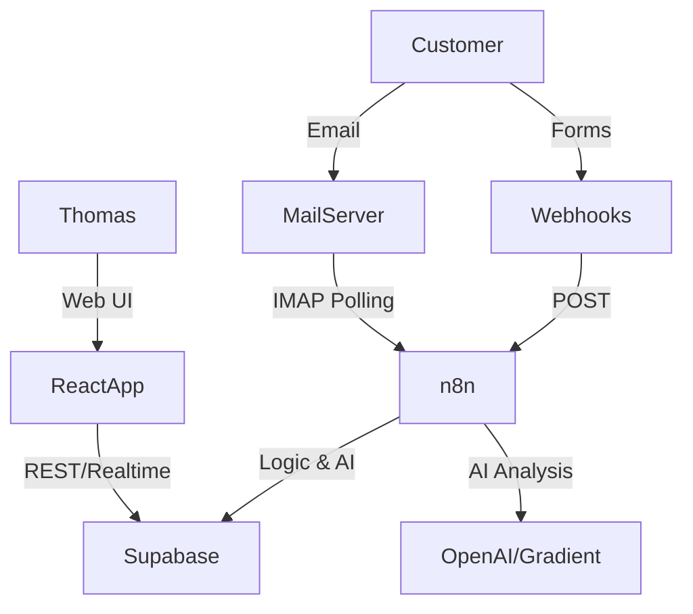

# Skyland CRM - Architecture

## 🏗 High-Level Overview

The system is a "Modulith" built on serverless components. It relies on Supabase for data & state, n8n for logic & integration, and a React SPA for the user interface.

## 🔐 Authentication & Security

### Strategy

* **Provider:** Supabase Auth
* **Method:** Email/Password (Thomas Only)
* **Mode:** Single-User Mode (Admin)
  * Currently, the system is designed for a single administrator (Thomas).
  * Row Level Security (RLS) is enabled for all tables.
  * `Authenticated read` policies allow authenticated users to view data.
  * `tasks`, `activity_log`, etc. have appropriate policies.

### Roles

* `anon`: Can only submit public forms (via separate API/RPC or filtered webhook).
* `authenticated`: Full access to CRM data.
* `service_role`: Used by n8n for backend operations (bypasses RLS).

## 🛠 Components

### 1. Frontend (React)

* Visualizes data from Supabase.
* Communicates directly with Supabase Client (`@supabase/supabase-js`).
* No "backend API" development needed; Supabase is the API.

### 2. Backend Logic (n8n)

* Replaces traditional backend code (Node/Python).
* Handles:
  * Ingesting emails (IMAP).
  * Processing form submissions.
  * AI Classification.
  * Sending notifications (Telegram/Email).

### 3. Database (Supabase)

* Single source of truth.
* PostgreSQL 15+.
* Stores Users, Leads, Jobs, Messages, and Logs.
